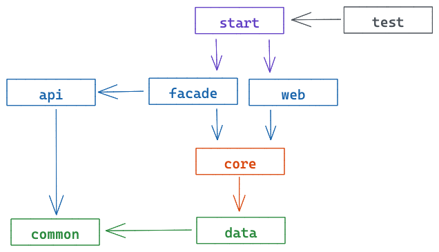
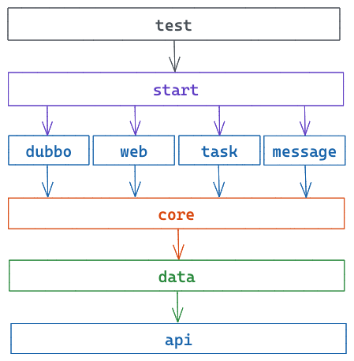
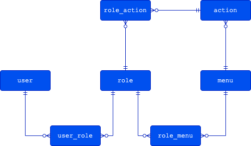

### 模块依赖

* api：接口模块，供外部系统使用的 Open Feign、Dubbo、gRPC 接口
* common：公共模块，定义其他模块都需要的 DTO、VO、常量、枚举、异常、错误码等
* data：数据模块，与底层 MySQL、Oracle、Hbase 等进行数据交互
* core：核心模块，提供业务服务，流程编排，实现业务逻辑的地方
* web：HTTP 请求处理模块，接收 HTTP 请求，进行参数校验，参数转换，权限控制，调用 core 模块完成业务处理
* facade：外观模块，实现 api 模块的接口，接收 RPC 请求，MQ 消息监听，任务调度消息监听，并调用 core 模块完成业务处理
* start：启动模块，启动类，参数配置
* test：测试模块，进行单元测试，Mock 测试的地方，其他模块不需要单独写测试代码

如果系统不需要对外提供接口，则可以不要 api 模块。如果觉得模块过多，可以由 api 模块承担 common 模块的功能，此时由 data 模块依赖 api 模块，facade 模块不再直接依赖 api 模块；同时可以去掉 test 模块，由各个模块各自完成自己的测试代码。facade 模块承担的职责没有想到更好的命名方法，暂且使用 facade 这一名称；另外一种做法是将 facade 模块的功能移到 core 模块。core 模块的名称采用了模糊的命名方法，也可以叫 biz 模块或者 service 模块。data 模块有的地方也叫 dal 模块、dao 模块或者 persistence 模块；目前 PO 对象也是放在这个模块，也有的做法是会有一个单独的 model 模块来承担这部分职责。如果系统有调用外部系统接口的需求，可以在 core 模块或者 data 模块实现。

### 分层领域模型

基本采用[Java开发手册(黄山版)](https://github.com/alibaba/p3c)中的约定，但有一些不一样的地方需要特别说明一下

* 与数据库表结构一一对应的对象使用 PO，DO 在代码中小写的时候与 Java 关键字 `do` 冲突；
* 在 Java 开发手册中 DO 是 Data Object 的缩写，容易与 DDD 中领域对象 Domain Object 混淆，那么在使用 DDD 开发方式命名领域对象时不添加任何后缀；
* 在 Java 开发手册中 VO 是 View Object 的缩写，也容易与 DDD 中的值对象 Value Object 混淆，但由于 VO 是 View Object 的缩写接受度更广，因此在工程中继续使用 VO 来表示视图对象，DDD 中的值对象在命名时仍然不添加任何后缀；
* DTO 它应该是一类对象的统称，在使用到它的地方应该是更具体的 Command、Event、Message 等对象，但似乎大多数时间没有这样做，在这个项目中依然采用统称 DTO

### 实体关系模型

### 参考资料

1. [Java开发手册(黄山版).pdf](https://github.com/alibaba/p3c)
2. [Java应用结构规范](https://mp.weixin.qq.com/s/oBsLNuJPeyVPegW2c37DVQ)
3. [第一节：基础框架工程构建](https://github.com/mercyblitz/java-training-camp/blob/main/stage-1/docs/01.%20%E7%AC%AC%E4%B8%80%E8%8A%82%EF%BC%9A%E5%9F%BA%E7%A1%80%E6%A1%86%E6%9E%B6%E5%B7%A5%E7%A8%8B%E6%9E%84%E5%BB%BA.md)
4. [第二节：业务工程模板定制](https://github.com/mercyblitz/java-training-camp/blob/main/stage-1/docs/02.%20%E7%AC%AC%E4%BA%8C%E8%8A%82%EF%BC%9A%E4%B8%9A%E5%8A%A1%E5%B7%A5%E7%A8%8B%E6%A8%A1%E6%9D%BF%E5%AE%9A%E5%88%B6.md)
5. [领域驱动设计系列文章（2）——浅析VO、DTO、DO、PO的概念、区别和用处](http://www.blogjava.net/johnnylzb/archive/2010/05/27/321968.html)
6. [COLA](https://github.com/alibaba/COLA)
